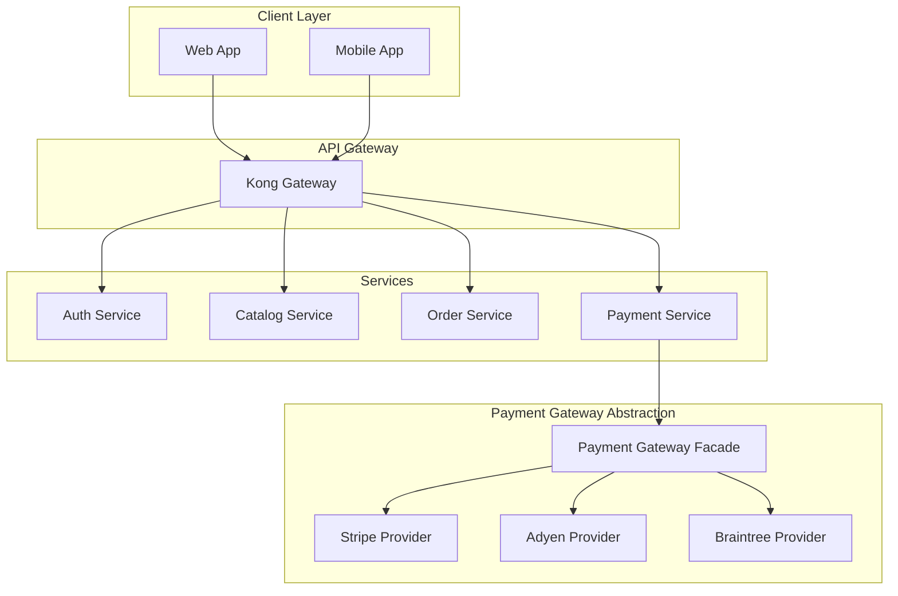

# Solution Architect Agent Examples

## Example 1: Architecture Decision Record

**ADR-007: Payment Provider Abstraction**

```
Status: ACCEPTED
Date: 2024-11-15

Context:
  We need to support multiple payment providers (Stripe, Adyen, Braintree)
  for multi-currency checkout. Direct coupling to Stripe is creating
  vendor lock-in and blocking EU expansion where Adyen has better rates.

Decision:
  Introduce a Payment Gateway abstraction layer using the Strategy pattern.
  Implementation details:
  - Common interface: IPaymentGateway
  - Provider-specific implementations as plugins
  - Provider selection via configuration + routing rules
  - Failover: primary → secondary → fallback

Consequences:
  + Enables multi-provider support without changing checkout flow
  + Provider switching without deployment (config-driven)
  + Clear boundaries for testing (mock providers)
  - Additional abstraction complexity (~2 weeks implementation)
  - Need to maintain PCI compliance across multiple providers
  - Transaction reconciliation becomes more complex

Compliance:
  - [x] Architecture review with Tech Lead
  - [x] Security impact assessment
  - [ ] Migration plan for existing Stripe transactions
```

## Example 2: Architecture Diagram (Mermaid)



## Example 3: Technology Selection Trade-off

**Tech Selection: Message Queue**

```
Options:
A. RabbitMQ  — mature, AMQP, 10k msg/s
B. Apache Kafka — high throughput, 1M msg/s, log compaction
C. AWS SQS/SNS — fully managed, no ops

Requirements:
- 5000 events/sec (peak) — fits all three
- At-least-once delivery — all support
- Exactly-once semantics — only Kafka (with idempotent producer)
- Event replay — Kafka (log compaction), others require custom
- Team experience: RabbitMQ (high), Kafka (low), SQS (medium)

Decision: RabbitMQ with planned Kafka migration in Q2
Rationale:
- Current volume well within RabbitMQ capacity
- Team can deliver faster with known technology
- Need 6 months to build Kafka expertise
- Migration to Kafka documented as ADR-008 for Q2

Risk: If growth exceeds projections, migration timeline accelerates.
Mitigation: Monitoring in place, SQS as interim scale-out option.
```
